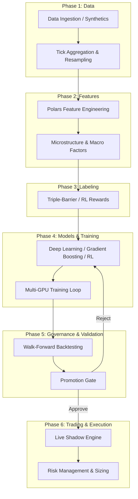

# Forex Scaling Model Architecture

Welcome to the architectural documentation for the Forex Scaling Model (v6.5+). This document provides a comprehensive overview of the system's design, components, data flows, and governance structures. This is a robust tick-to-trade forex research, training, and execution pipeline utilizing advanced machine learning, reinforcement learning, and rigid quant-style governance.

## High-Level System Architecture

The pipeline operates in distinct, decoupled phases running sequentially from data ingestion through to live shadow deployment. The architecture emphasizes modularity, high-performance data manipulation, and strict model validation.

## Component Breakdown

The repository is structured into domain-specific packages.

### 1. Data Pipeline (`data/`)
Handles the sourcing and preparation of financial data.
- **Ingestion & Loaders**: Integrates with multiple data sources including Databento, EODHD, Myfxbook, and Dukascopy. Supports both historical tick data and synthetic data generation.
- **Processing**: Responsible for temporal alignment, tick compaction, session filtering, and fractional differencing. 
- **Caching**: Employs highly-optimized chunking strategies using formats like DuckDB and Zarr for downstream GPU access.

### 2. Feature Engineering (`features/`, `feature_store/`)
Transforms raw price and volume series into predictive signals.
- **Polars Core Engine**: The majority of feature generation (`feature_engineering_pl.py`) relies on `polars` expressions to maintain extreme performance and memory safety.
- **Microstructure & Macro**: Builds advanced indicators including Level 2 Order Book proxies, trade arrival rates, tick volume imbalance, Hurst exponent, and fractal dimensions.
- **Lookahead Guards**: Incorporates strict boundary validations to prevent future data leakage into historical features.

### 3. Labeling (`labeling/`)
Defines the targets the models are trying to predict.
- **Triple Barrier**: Classic quantitative labeling framework targeting upper profit takes, lower stop losses, and time horizons.
- **RL Rewards**: Continuous or discrete reward functions crafted for policy-gradient and value-based reinforcement learning agents.

### 4. Models & Training (`models/`, `training/`)
The core machine learning engine.
- **Architectures (`models/`)**: Supports diverse architectures including:
  - Gradient Boosted Trees: CatBoost and XGBoost (used primarily for tabular baselines).
  - Deep Learning: PyTorch-based neural networks (e.g., GNNs, temporal convolution) for large sequence length predictions.
  - RL Agents: Advanced PPO/DQN configurations.
- **Training Orchestration (`training/`)**: Features a sophisticated `train_gpu.py` multi-GPU loop supporting online hard-example mining, continuous curriculum learning, synaptic intelligence, and feature ablation.
- **Knowledge Distillation**: Models can be scaled down via `scale_model.py` for faster inference.

### 5. Backtesting & Execution (`backtesting/`, `trading/`, `execution/`)
Simulates model performance and runs live strategies.
- **Walk-Forward Testing**: Evaluates models on sequential out-of-sample data windows to prove temporal generalization.
- **Trading Engine (`trading/`)**: The `live_engine.py` process acts as the deployment vehicle, integrated with real brokers using state machines for live safety guards (spreads, rate limits, equity staleness halts).
- **Execution & Sizing (`risk/`, `sizing/`)**: Integrates Kelly criterion variations, Almgren-Chriss execution policies, and dynamic portfolio allocation constraints to govern order sizes and risk limits.

### 6. Governance & Validation (`validation/`, `monitoring/`)
The rigid, quant-style automated gatekeeper.
- **Promotion Gate (`validation/promotion_gate.py`)**: A deployed model must pass hard thresholds for out-of-sample Sharpe Ratio, Maximum Drawdown, Profit Factor, and transaction cost margins.
- **Lineage Tracking (`audit/`)**: Guarantees reproducibility by tracking dataset schemas, code versions, and random seeds against output artifacts. MLflow handles the active registry.

### 7. Configuration (`config/`)
All orchestration behavior is declaratively managed.
- YAML Overlays: `run.yaml`, `run_deep.yaml`, `run_rl.yaml`, `run_tabular.yaml` provide highly tailored, architecture-specific overrides for dataset lengths (e.g., 20M vs 5M ticks), chunk sizing, and sequence windows.
- Managed heavily by `settings.py` acting as the bridge to python datastructures and handling environment variables.

## Detailed Workflow: Tick-to-Trade (System Mechanics)

The Forex Scaling Model operates on a rigid, step-by-step pipeline comprising 70+ interconnected components. The workflow guarantees strict isolation between data preparation, model training, robust backtesting, and live execution.

### Phase 0: Governance & Macro Data
Before any localized data processing begins, the system initializes macro-level and governance controls:
- **Macro Factors:** The `EcoCalendarFeatureBuilder` and `MacroYieldFeatureBuilder` generate synthetic or FRED-bridged macro features (e.g., US10Y vs G10 Spreads, NFP/CPI events). 
- **Sentiment Analysis:** A 3-tier sentiment pipeline (`SentimentPipeline`) scores financial headlines using Ollama (Mistral), FinBERT, or VADER as a fallback.
- **Tracking & Governance:** MLflow tracks all artifacts, code versions, and parameters, while a rigid `PromotionGate` sits at the end of the pipeline to evaluate models based on exact metrics (e.g., Probabilistic Sharpe Ratio > 1.82, TCA Ratio limits).

### Phase 1: Data Ingestion & Compaction
- **Ingestion:** The `ForexDataPipeline` retrieves raw tick data (or generates synthetic ticks via `generate_synthetic_tick_data`) from sources like Databento or Dukascopy.
- **Compaction:** Ticks are resampled into frequency-based bars (e.g., 1-minute), subjected to session filtering (e.g., Asian/London/NY overlap flags), and fractionally differenced to achieve stationarity while retaining memory.

### Phase 2: Feature Engineering (Polars Engine)
- **Base Features:** The `FeatureEngineer` generates technical baseline indicators (ATR, rolling lags) using highly optimized Polars expressions (`feature_engineering_pl.py`).
- **Advanced Features:** The `AdvancedFeatureBuilder` layers on complex microstructure proxies:
  - **L2 Order Book Proxy:** Computes order book imbalance and microprice.
  - **Tick Imbalance & Momentum:** Generates Tick Volume Imbalance (TVI) and directionality metrics.
  - **Statistical Regimes:** Computes rolling Pearson correlation breakdowns, Hurst exponent, and Fractal dimension to classify trending vs. mean-reverting states.
  - **Derivatives & Macro Proxies:** Calculates options skew (risk-reversal proxies) and COT institutional positioning bias.
- **Data Boundary Rules:** All transformations up to this point remain in Polars. Data is only converted to Pandas or NumPy (`.to_numpy()`) directly at the ML model boundary to prevent memory leakage and slowdowns.

### Phase 3: Labeling
- **RL Reward Shaping:** Uses `compute_rl_reward_labels` and `SharpeRewardWrapper` to label bars dynamically. The shaping applies Differential Sharpe optimization (Moody & Saffell), evaluating PnL distributions rather than static price targets.
- **Triple-Barrier:** Classic time, stop-loss, and profit-target horizon limits are calculated for supervised training modes.

### Phase 4: Model Training & Meta-Ensembles
The architecture orchestrates 6 base supervised models (TFT, iTransformer, HAELT, Mamba, GNN, EXPERT) and RL agents:
- **Graph Neural Networks (GNN):** `GrangerCausalityGraph` creates directed adjacency matrices between cross-asset pairs (e.g., EURUSD vs US10Y) allowing multi-variate signal propagation.
- **Multi-Timeframe Attention:** A hierarchical multi-timeframe transformer fuses 1m, 5m, and 15m intervals into a unified gated representation.
- **Reinforcement Learning (RL):** PPO and DQN agents undergo **Curriculum Learning** (`CurriculumScheduler`), moving dynamically from low-volatility epochs to full-data news event regimes. They utilize **Hindsight Experience Replay (HER)** to relabel failed trades, amplifying positive training signals by 4-8x.
- **Meta-Learner Ensemble:** A stacked MLP acts as a meta-learner, dynamically weighting predictions from the sub-models based on real-time market regimes.
- **Uncertainty Quantification (UQ):** Monte Carlo Dropout evaluates 50 forward passes, suppressing 15-25% of low-confidence signals.

### Phase 5: Backtesting & Infrastructure Evaluation
- **True Walk-Forward Validation:** Trained checkpoints are routed to `scripts/backtest_true_walk_forward.py`. 
- **Lockbox Testing:** The `LockboxEvaluator` splits data into training/validation and a strictly sealed out-of-sample block.
- **Monte Carlo & Slippage:** Strategy robustness is quantified via random shuffle/bootstrap runs (`MonteCarloBacktest`) ensuring tight 95% Confidence Intervals on Sharpe ratios. A `SlippageCalibrator` non-linearly applies expected transaction costs based on trade size.
- **Shadow Mode:** The `ShadowModeDeployer` simultaneously runs the candidate against the live model on unseen bars, measuring signal agreement and PnL delta.

### Phase 6: Live Execution, Risk Management & Monitoring
Upon passing the `PromotionGate` and shadow deployment tests:
- **Execution:** Models are optimized via ONNX (for 3-5x CPU inference speed) and dispatched to the live environment.
- **Risk & Sizing Logic:** 
  - *Regime-Conditional Kelly:* Adjusts the base Kelly fraction dynamically based on current Hurst exponents and correlation regimes.
  - *Almgren-Chriss Execution:* Chunks larger positions to minimize expected market impact.
  - *Portfolio VaR:* Continuously updates parametric Value-at-Risk, enforcing 99% confidence caps across correlated pairs.
  - *Drawdown Aware Policy:* An equity-curve circuit breaker (`DrawdownAwareExitPolicy`) halts trading or cuts sizes based on real-time intra-day PnL.
- **Real-Time Monitoring:** 
  - `ForexPrometheusExporter` exposes metrics to Grafana.
  - `DemotionMonitor` applies Page-Hinkley drift detection on real-time equity curves to trigger automatic rollback upon structural alpha decay.
  - `DiscordAlerter` fires off webhooks for critical pipeline events.

## Technology Stack Principles

*   **Language**: Python >= 3.11.
*   **Data Processing**: DataFrames must use `Polars` (`pl.Expr`, `pl.DataFrame`) everywhere before the model boundary. `Pandas` is restricted strictly to integration boundaries (e.g., Scikit-Learn transformers or library dependencies that require it).
*   **Deep Learning**: PyTorch (`torch`) is the standard for deep models and RL, highly optimized for CUDA.
*   **Tree Models**: CatBoost is heavily favored for high-signal, categorical-friendly inference.
*   **Formatting/Linting**: Strictly enforced via `ruff` and gradual typing verified by `pyright`.
