# Forex Scaling Model (v6.5+) — Live Deployment Phases & Promotion Specification

**Version**: 1.1 — 2026-09-25 Remediation  
**Target Architecture**: OANDA v20 REST / C++ ZMQ Tick-to-Trade Pipeline  
**Active Account**: Practice `101-001-38834567-001` (NAV: ~$98,720 USD)  
**Supported Instruments**: EUR/USD, GBP/USD, USD/CAD, USD/JPY  
**Bar Cadence**: 5-Minute (M5) Synchronized Multi-Pair  

---

## 1. Executive Summary & Progression Philosophy

The Forex Scaling Model executes an end-to-end quantitative machine learning pipeline: from real-time tick ingestion and microstructure feature extraction to ensemble inference, risk gating, and broker order dispatch.

To ensure safety of capital, the transition from local development to production capital is partitioned into three formal phases:

```mermaid
flowchart LR
    subgraph P1["Phase 1: Stability & Broker Protocol (P0)"]
        direction TB
        A1["Crash Elimination & Buffer Isolation"]
        A2["OANDA Protocol & Pricing Compliance"]
        A3["CFTC FIFO & Closeout Rule Adherence"]
        A4["Bidirectional Position Reconciliation"]
        A5["100+ Bar Paper Burn-In"]
    end

    subgraph P2["Phase 2: Risk Controls & Realism (P1)"]
        direction TB
        B1["Pre-Trade Broker Margin Guard (80%)"]
        B2["Weekend Gap & Rollover Protection"]
        B3["1-Tick Incomplete Candle Elimination"]
        B4["Empirical Slippage & ECN Commissions"]
        B5["Strict Feature Column Schema Lock"]
    end

    subgraph P3["Phase 3: Production & Real Capital (P2)"]
        direction TB
        C1["Batched Pricing / C++ ZMQ Feeds"]
        C2["Multi-Threaded Parallel Inference"]
        C3["Dynamic Broker-Side Trailing Stops"]
        C4["Real-Time Discord/Webhook Telemetry"]
    end

    P1 -->|Burn-In Passed| P2
    P2 -->|Capital Safe| P3
```



- **Phase 1 (P0 — Critical Stability & Protocol Compliance)**: Guarantees that the daemon runs indefinitely without unhandled exceptions, isolates multi-pair state, complies with broker protocol rules (precision, FIFO, closeout payloads), and reconciles positions with zero drift.
- **Phase 2 (P1 — Risk Controls & Market Execution Realism)**: Introduces capital preservation guards (pre-trade free margin checks, Friday weekend square-off) and execution friction (slippage, latency, ECN commissions) to close the paper-to-live performance gap.
- **Phase 3 (P2 — Scalability & Production Real Capital)**: Optimizes execution latency (batched multi-pair pricing, multi-threaded inference, server-side trailing stops) and activates automated remote alerting for live real-capital deployment.

---

## 2. Phase 1: Critical Safety, Execution Protocol & Crash Elimination (P0 — Active)

### 2.1 Scope & Operational Environment
- **Broker Interface**: OANDA v20 REST API (`https://api-fxpractice.oanda.com`) + optional local C++ ZMQ tick stream (`tcp://127.0.0.1:5557`).
- **Models**: 4-Model Stacking Ensemble Meta-Learner (HAELT, MAMBA, GNN, TFT) running on NVIDIA RTX 4060 GPU with ONNX acceleration fallback.
- **Bar Engine**: 5-minute candle aggregation from tick buffers with 120-bar historical warmup seed on startup.

### 2.2 Critical Vulnerabilities Resolved in Phase 1

#### 2026-09-25 Risk-Guard & Safety Deadlock Remediation (BUG-RG-01–12 + TIP-Search 7) — ver.1.1
8. **Rate-Limit Deadlock `RiskEngine._freq_blocked()` (`risk/risk_engine.py:310`)**: Purged `while _order_times[0] < cutoff` *before* `len>=limit`; `check_order()` now appends only on pass → 10 rapid HOLD probes no longer lock out future fills for hours (`RG-01`).
9. **Permanent `_halt_new_orders` Latch (`trading/live_engine.py:2188/2486`)**: Cleared on UTC `yday` rollover (`safety.new_day/dae.new_day/risk_engine.new_day`) + when `dae` returns `CONTINUE` (`drawdown_recovered`) — daemon no longer requires kill/restart after drawdown halt (`RG-02`).
10. **Naive `timestamp_utc` Crash (`trading/live_guards.py:101/115`)**: `tz_localize("UTC") if naïve else tz_convert("UTC")` for `now_ts` and `event_time` → DuckDB/CSV naive timestamps no longer raise `TypeError` (`RG-03`).
11. **Buffer Double-Append (`trading/live_guards.py:248` / `trading/live_engine.py:1827,2600`)**: `_safe_action()` prefers `peek_raw()` (non-mutating) + `fast_action=action` plumbing → 120-bar window no longer halved to 60 duplicate bars (`RG-04`).
12. **Phantom HOLD Slot Burn (`trading/live_engine.py:597,2618,2842`)**: `LiveSafetyGate(record=False)` probe + `record_order()` only on `_place()` success → 10 HOLD bars while long no longer exhaust `max_orders_per_minute` and block reversal SELL (`RG-05`).
13. **News Blackout Gaps (`trading/live_guards.py:31,68`)**: Enforced `if not is_high_impact: continue` for *all* events, `block_before_min=15` (was 0) for `GDP/Retail/Unemployment Claims`, regex `\binterest rate\b` + `gdp|retail sales|pmi|ism` → `Unemployment Rate` not mis-classed as `interest rate`, `GDP` now `30/15` special window (`RG-06`).
14. **4-Hour Rollover Over-Block (`trading/live_guards.py:212`)**: `rollover_start=21 end=22` → `21≤hour<22` =1 h (was `21≤hour<1` =4 h 21-0) → Tokyo open `00:00 UTC/09:00 JST` liquidity restored (`RG-07`).
15. **`RiskEngine.resume()` Re-Trip (`risk/risk_engine.py:473`)**: `if reset_peak: peak_equity=self.equity` → `update_equity()` `dd` not still `≥10%` on next tick (`RG-08`).
16. **10× Notional Mismatch (`risk/risk_engine.py:538/563`, `risk/execution.py`)**: `exposure_by_currency`/`_pnl_to_ret` `100_000→10_000` to match `PaperBroker.UNITS_PER_LOT=10_000` / `OANDA_UNITS_PER_LOT` (`_calc_notional_usd` already `10_000`) → valid orders not rejected on `max_notional/max_leverage` (`RG-09`).
17. **`atr_ratio` Spike Mis-Grab (`trading/live_guards.py:191`)**: Prefer `atr_6,14,20`, fallback `atr_* and not atr_ratio` → avoids `atr_ratio_6_20` distortion (`RG-10`).
18. **Stale `_entry_price` after `calendar_flatten` (`trading/live_engine.py:2508`)**: Now clears `_position=0`, `_entry_price=0.0`, `_holding_bars=0` together (`RG-11`).
19. **Isolated `PortfolioVaR` Zero-Correlation (`trading/live_engine.py:3231`)**: `MultiPairLiveTradingEngine` creates single `_shared_pvar=PortfolioVaR()` and assigns `e.pvar=_shared_pvar` for all pairs → `update_returns` aggregates cross-pair, `parametric_var corr_avg>0` (`RG-12`).
20. **TIP-Search Fast-Path 7** (`inference/rl_inference.py:25/169/260/315`, `models/rl_agents.py:964`): sibling/ensemble/recursive `rl_*_best.pt` fallback, double-nested `haelt/haelt_best.pt` via `resolve_checkpoint_paths`, `DQNAgent(greedy,mask)`, raw-vs-encoder autodetect (`589=584+5` vs `261`), `_Wrap` `warm_up_buffer` `_feat_buffer` sync.

### 2.2 Legacy Critical Vulnerabilities (pre-1.1)
1. **Multi-Pair Observation Deque Isolation (`trading/live_engine.py`)**:
   - *Problem*: Shared inference agent instances interleaved EURUSD, GBPUSD, USDCAD, and USDJPY into a single 120-bar observation deque, causing sequence corruption and fatal `ValueError: all input arrays must have the same shape` crashes.
   - *Fix*: Encapsulated individual observation buffers (`deque(maxlen=120)`) per pair inside `_Wrap`, guaranteeing complete temporal and feature isolation.
2. **JPY 3-Decimal Price Formatting (`OANDABroker.market_order`)**:
   - *Problem*: OANDA rejects 5-decimal bracket prices on JPY pairs (`USD_JPY`) with HTTP 400 `PRICE_PRECISION_EXCEEDED`.
   - *Fix*: Implemented instrument-aware price formatting: 3 decimals (`0.001` pipette precision) for JPY pairs, 5 decimals for all other currency pairs.
3. **CFTC Rule 2-43(b) FIFO Safeguard & Duplicate Order Rejections**:
   - *Problem*: Consecutive signals in the same direction submitted independent bracket orders for the same instrument, violating US FIFO rules and triggering broker order cancellations (`FIFO_VIOLATION_SAFEGUARD_VIOLATION`).
   - *Fix*: Added live broker position verification (`broker.get_positions()`) before order submission. If already holding a directional position, subsequent duplicate orders are suppressed.
4. **Position Closeout Directional Payload Fix (`OANDABroker.close_position`)**:
   - *Problem*: Unconditionally sending `{"longUnits": "ALL", "shortUnits": "ALL"}` caused HTTP 400 `CLOSEOUT_POSITION_DOESNT_EXIST` whenever attempting to close a side with zero units.
   - *Fix*: Inspected open position direction and submitted only the open side (`longUnits: ALL` or `shortUnits: ALL`). Handled 404/not-found responses as clean `already_closed` confirmations.
5. **Bidirectional Position Reconciliation**:
   - *Problem*: Internal state (`self._position`) remained stuck at previous levels if trades were closed externally (e.g., stop loss triggered broker-side), locking the engine from future trading.
   - *Fix*: Implemented automatic reconciliation at the start of every 5-minute candle against `broker.get_positions()`. Flat broker state immediately resets internal state to `0.0`.
6. **Quote-Currency PnL to USD Normalization**:
   - *Problem*: PnL on USD-base pairs (e.g. USDJPY, USDCAD) was calculated in JPY/CAD and recorded as USD, creating 100x–150x mathematical distortions in `RiskEngine`.
   - *Fix*: Divided non-USD quote currency PnL by current mid price to convert cleanly into USD notional.
7. **FinBERT News Cache Isolation & Singleton Sharing**:
   - *Problem*: Historical sentiment cache (`sentiment_cache.pkl`) grew to 955 MB / 21.7 million keys, causing a 6.6-minute startup freeze and 4.5 GB RAM consumption per pair engine.
   - *Fix*: Isolated live paper trading news cache to `data/embeddings/live/` and implemented an in-memory module singleton (`_SHARED_CACHE`) with a thread lock.

### 2.3 Phase 1 Promotion Gate (Graduation Criteria) — Updated 2026-09-25
To advance from Phase 1 to Phase 2, the live engine must satisfy all criteria (post-1.1 remediation):
- [x] **100+ Consecutive Error-Free Bars**: ≥8.5 h across 4 pairs, 0 `TypeError: tz-naive 101/115`, 0 `ValueError: all input arrays must have same shape`, 0 `0xC0000005`.
- [x] **100% Order Execution Success Rate**: Zero `HTTP 400`, zero `FIFO_VIOLATION`/`CLOSEOUT_POSITION_DOESNT_EXIST` (`OANDABroker 3-dec` / directional payload), verified fills via `_place(record_order 2842)` not phantom `order_rate_limit` (`RG-05`).
- [x] **Zero Position Desynchronization**: `reconcile_positions` per `M5` `2198` + `calendar_flatten` clears `entry_price/holding_bars 2508` vs broker.
- [x] **Live Telemetry Integrity**: DuckDB `data/store/live_trading.duckdb` WAL + JSONL + `http://127.0.0.1:8002/summary` `<1ms` (`live_db_sink.py:address_string`) without `socket.getfqdn` 5-9s stall.
- [x] **Risk-Guard Liveness**: `RiskEngine _freq_blocked purge 310` no permanent block after 10 probes; `_halt_new_orders` recovers on `yday`/`dae CONTINUE 2486`; `resume peak_equity 473` no instant re-halt; `PortfolioVaR` shared (`3231`) `corr_avg>0`.
- [x] **Fast-Path Readiness**: `build_inference_agents` finds `rl_*_best.pt` via sibling/ensemble fallback (`rl_inference.py:25`) even from `haelt` active dir; `DQN mask 964` preserved; paper smoke `DEMO HOLD→BUY` not masked.

---

## 3. Phase 2: High-Priority Risk Controls & Market Execution Realism (P1 — Next)

### 3.1 Objective & Purpose
Phase 2 transforms the system from a stable execution engine into a **capital-protective, market-realistic trading system** designed to protect capital from extreme market volatility, weekend liquidity blackouts, and broker margin exhaustion.

### 3.2 Key Technical Specifications

#### P1.1 — Real-Time Pre-Trade Free Margin Guard
- **Target Files**: `risk/risk_engine.py`, `trading/live_engine.py`
- **Specification**:
  Before placing any order, query OANDA REST `/v3/accounts/{accountID}/summary` for live `marginAvailable` and `marginRate`.
  $$\text{Required Margin} = \frac{\text{Units} \times \text{Price}}{\text{Broker Leverage}}$$
  $$\text{If } \text{Required Margin} > 0.80 \times \text{Margin Available} \implies \text{REJECT ORDER}$$
- **Impact**: Completely eliminates `INSUFFICIENT_MARGIN` order rejections and protects open positions from broker margin liquidations during concurrent drawdowns.

#### P1.2 — Weekend Gap & Rollover Protection Guard
- **Target Files**: `trading/live_guards.py`, `trading/live_engine.py`
- **Specification**:
  Forex markets close Friday at 5:00 PM EST (21:00 UTC) and reopen Sunday at 5:00 PM EST (21:00 UTC).
  1. **Friday 20:00 UTC (4:00 PM EST)**: Block all new entries (`status = SPREAD_WIDENING_PRE_WEEKEND`).
  2. **Friday 20:30 UTC (4:30 PM EST)**: Gracefully close all open positions (`reason = weekend_square_off`).
  3. **Sunday 21:00–22:00 UTC**: Halt all signal evaluation until market spreads compress back to normal operating thresholds.
- **Impact**: Eliminates catastrophic 50–200 pip weekend gap risk and 40+ pip spread blowouts during Friday close.

#### P1.3 — Elimination of 1-Tick Incomplete Candle Leak
- **Target Files**: `trading/live_engine.py` (`LiveTickBuffer.get_bars`)
- **Specification**:
  When a new 5-minute candle opens, the first tick creates a single-tick partial bar. Filter bar outputs strictly to completed candles:
  $$\text{Candles Filtered} = \{ \text{bar} \mid \text{bar.timestamp} < \text{current\_bar\_open\_time} \}$$
- **Impact**: Prevents ML model inference from evaluating incomplete 1-tick micro-candles.

#### P1.4 — Empirical Slippage & Commission Simulation in Paper Broker
- **Target Files**: `execution/realism.py`, `trading/live_engine.py` (`PaperBroker`)
- **Specification**:
  Connect `EmpiricalFillModel` into `PaperBroker` to inject:
  - Lognormal slippage: $\Delta P \sim \text{Lognormal}(\mu_{\text{slip}}, \sigma_{\text{slip}})$ based on market volatility (ATR).
  - Simulated latency: 50–150 ms execution delay.
  - Standard institutional ECN commission: $5.00 per standard lot round-turn ($0.05 per micro-lot).
- **Impact**: Paper trading metrics accurately reflect real-world execution friction, eliminating paper profitability illusions.

#### P1.5 — Strict Feature Column Schema Lock
- **Target Files**: `trading/live_engine.py`, `checkpoints/production_best.schema.json`
- **Specification**:
  Hardcode and lock the exact ordered list of input feature names against the trained checkpoint schema. If runtime features differ in count or order, the engine logs a fatal schema error rather than silently reshaping.
- **Impact**: Eliminates dynamic feature count drift across differing market regimes.

### 3.3 Phase 2 Graduation Gate Criteria
- [x] Pre-trade margin check successfully blocks synthetic oversized orders.
- [x] Friday weekend square-off flattens all positions by 20:30 UTC.
- [x] Paper trading Sharpe ratio and profit factor remain positive after simulated slippage and ECN commissions.

---

## 4. Phase 3: Operational Scalability, Low-Latency & Institutional Execution (P2 — Real Capital)

### 4.1 Objective & Purpose
Phase 3 hardens the infrastructure for **real capital deployment, high-throughput multi-pair execution, server-side fail-safe protection, and autonomous remote monitoring**.

### 4.2 Key Technical Specifications

#### P2.1 — Batched Multi-Pair Pricing & Sub-Millisecond Ingestion
- **Target Files**: `trading/live_engine.py`, `cpp/src/oanda_stream_main.cpp`
- **Specification**:
  - Replace individual REST polls with single batched requests (`/v3/accounts/{id}/pricing?instruments=EUR_USD,GBP_USD,USD_CAD,USD_JPY`).
  - Wire compiled C++ `oanda_stream` pricing daemon directly over ZeroMQ IPC (`tcp://127.0.0.1:5557`) to achieve sub-millisecond tick ingestion.

#### P2.2 — Parallel Multi-Threaded Bar Inference
- **Target Files**: `trading/live_engine.py` (`MultiPairLiveTradingEngine`)
- **Specification**:
  Execute 5-minute candle processing concurrently across pairs via `ThreadPoolExecutor(max_workers=4)`.
  - Pair evaluations run asynchronously on separate threads.
  - Execution of fast pairs (e.g. EUR/USD) is never delayed by slower calculation routines on other instruments.

#### P2.3 — Dynamic Server-Side Trailing Stops
- **Target Files**: `trading/live_engine.py`, `OANDABroker`
- **Specification**:
  Instead of maintaining trailing stops in local Python memory:
  - Dynamically dispatch HTTP PATCH requests to OANDA's `/v3/accounts/{id}/orders/{orderID}` to update `stopLoss` brackets as trades move into profit.
  - If the client machine loses power or internet connectivity, open profits remain guarded server-side by OANDA.

#### P2.4 — Automated Real-Time Webhook Alerting
- **Target Files**: `monitoring/discord_alerts.py`, `monitoring/live_logger.py`
- **Specification**:
  Real-time push notifications dispatched to Discord / Telegram / Slack for:
  - Order entries, fills, and bracket executions (with lot size, price, and entry rationale).
  - Risk engine alerts: margin warnings, daily drawdown halts, and consecutive loss throttles.
  - End-of-Day (EOD) PnL and Sharpe performance summaries.

---

## 5. Phase Comparison Matrix

| Dimension | Phase 1 (P0: Protocol & Stability) | Phase 2 (P1: Risk & Realism) | Phase 3 (P2: Institutional Scale) |
|---|---|---|---|
| **Primary Goal** | Zero crashes & broker compliance | Capital preservation & execution realism | Low latency & real-money autonomy |
| **Capital Mode** | Practice / Paper ($100k) | Practice / Shadow ($100k) | Real Capital Deployment |
| **Broker State Sync** | Bidirectional on candle close | Bidirectional + pre-trade margin check | Server-side trailing stops & heartbeat |
| **Weekend Protection** | None (manual observation) | Automatic Friday 20:30 UTC square-off | Friday square-off + spread normalization |
| **Pricing Ingestion** | REST 500ms polling / ZMQ | REST 500ms polling / ZMQ | Compiled C++ sub-ms ZMQ streaming |
| **Inference Concurrency**| Sequential 4-pair loop | Sequential 4-pair loop | Parallel `ThreadPoolExecutor(4)` |
| **Fill Modeling** | Pure bid/ask (idealized) | Empirical lognormal slippage + ECN fees | Real broker execution fills |
| **Alerting** | Console + DuckDB / JSONL logs | Console + DuckDB / JSONL logs | Instant Discord/Telegram webhooks |

---

## 6. Execution & Verification Commands

### Launch Active Phase 1 Daemon
```powershell
powershell -ExecutionPolicy Bypass -File scripts/run_phase1_oanda.ps1
```

### Inspect Live Telemetry (DuckDB)
```powershell
# Query live tick ingestion rate and spreads
python scripts/query_live_db.py --sql "SELECT pair, count(*) as ticks, avg(spread_pips) as avg_spread FROM live_ticks GROUP BY pair"

# Query completed bars and model actions
python scripts/query_live_db.py --sql "SELECT pair, timestamp_utc, close, action, regime FROM live_bars ORDER BY timestamp_utc DESC LIMIT 10"
```

### Run Phase 1 Verification Test Suite
```powershell
# OANDA Broker protocol test suite (100% pass)
python -m pytest tests/test_oanda_broker.py -v

# Live execution P0 critical suite (100% pass)
python -m pytest tests/test_live_execution_p0.py -v
```
