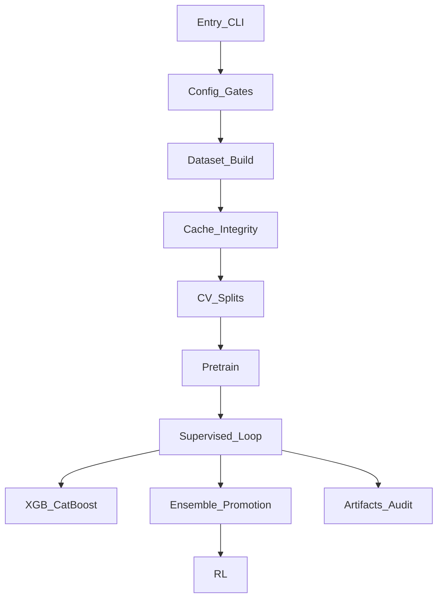

# Training Pipeline Audit

**Date:** 2026-08-04  
**Scope:** Stage-by-stage audit of model training after the `train_gpu.py` split.  
**Method:** Static code review + re-verification of archived TM/SYS/DS IDs + existing gates/tests.  
**Hub:** [`training/train_gpu.py`](../training/train_gpu.py) → focused modules under [`training/`](../training/).

Historical baselines (do not treat as current): [`archive/TRAINING_MODEL_AUDIT_REPORT.md`](archive/TRAINING_MODEL_AUDIT_REPORT.md), [`archive/SYSTEMS_AUDIT_REPORT.md`](archive/SYSTEMS_AUDIT_REPORT.md), [`archive/DATASET_IMPROVEMENT_REPORT.md`](archive/DATASET_IMPROVEMENT_REPORT.md), [`archive/FIXES_APPLIED.md`](archive/FIXES_APPLIED.md).

---

## Remediation (2026-08-04)

Top-5 P0/P1 items from this audit were implemented in-tree:

| Item | Status |
|------|--------|
| CLI `timedelta` / `_settings`; `all_models` default False; deep queue via `resolve_models_to_train` | **Fixed** |
| CatBoost shelled from `train_gpu` like XGB; native CatBoost params | **Fixed** |
| Regime labeler bid/ask exits (DS-001); cache tag `lexit-bid_ask` | **Fixed** |
| Ensemble meta samples trainable prefix only | **Fixed** |
| Embargo `max(yaml, seq+LH+delay)`; VALIDATION stubs synced | **Fixed** |
| Promotion `gate_input_type=execution_backtest`; unknown/proxy fail-closed; smoke `feature_schema_gate=False` | **Fixed** |
| Multitask Sharpe double-sqrt; YAML warmup/pretrain epoch contradictions | **Fixed** |

**Post-fix gates:** `--validate-config` OK; targeted training/audit tests **92 passed**.

**Also fixed (follow-up 2):** Tabular XGB/CatBoost use `cv_splits` purge/embargo; pretrain `PretrainGuardrails` + `PretrainHandoffGate` wired; `_StageTimer` → `run_manifest.stage_timings_s` + `logs/stage_timings.jsonl`; BrokerBridge fail-closed (`BrokerNotConnectedError`); live non-paper requires `promotion_gate.json`.

**Also fixed (follow-up 3):** `BrokerBridge.get_latency` (MT5 ping/tick RTT + IBKR `reqCurrentTime`); IBKR via optional `ib_insync`; `_StageTimer` samples GPU util/temp/mem → `run_manifest.gpu_stats` + `logs/stage_timings.jsonl`.

**Also fixed (follow-up 4 — modules 26–36):** Sharpe softsign (TPA-S04); `distillation.student_model` YAML map; module-slice table at end of this doc. Residual: hub KD ignores `distill_temperature` (MSE).

**Also fixed (follow-up 5 — cache / loop perf):** Polars-first `_build_chunk` + Polars HTF; Zarr `X` as FP16; fused AdamW (`build_adamw`); Linux Zarr **lz4@1** via `default_zarr_compression`. See CONTINUE “Just landed”.

**Audit backlog status:** closed for code-fixable training items (incl. curriculum / GPU util slice + cache/loop perf).

---

## Executive summary (audit-time)

Training is structurally healthier after the split and config gates. At audit time the following P0s blocked or corrupted the default path (now remediated — see above):

1. `parse_args()` crashed on missing `timedelta` / unbound `_settings`.
2. Default `--all-models` queue included non-registry `catboost`; YAML CatBoost was never shelled.
3. Default regime labels exited at mid (DS-001 residual).
4. Ensemble meta randomly sampled the full cache, including the promotion holdout.

**Gate evidence (at audit time → after fix):**

| Check | Audit | After fix |
|-------|-------|-----------|
| `--validate-config --config config/run.yaml` | FAIL (`timedelta`) | **OK** |
| curriculum/config/CV/smoke/priority2/resolve_models | mixed | **92 passed** |

---

## Pipeline map



---

## Stage verdicts

| # | Stage | Verdict | Top risk |
|---|-------|---------|----------|
| 1 | Entry / CLI | **FAIL** | `timedelta` / `_settings` crash; broken all-models default |
| 2 | Config gates | **RISK** | Gates solid when run; not automatic; YAML warmup/epochs invalid |
| 3 | Dataset / labels / features | **FAIL** | Regime mid-exit labels (default path) |
| 4 | Cache integrity | **RISK** | Length checks OK; no semantic label/warmup versioning |
| 5 | CV / embargo | **RISK** | YAML embargo 60 < dynamic need ~111 |
| 6 | Pretrain | **RISK** | Works; guardrail modules unwired; min_epochs > epochs |
| 7 | Supervised loop | **PASS*** | TM-001/SYS-005/007 fixed; multitask Sharpe still double-sqrts |
| 8 | XGB / CatBoost | **FAIL** | CatBoost unwired; param/YAML mismatch |
| 9 | Ensemble / promotion | **FAIL** | Meta holdout contamination; weak `gate_input_type` audit |
| 10 | RL | **RISK** | Cache required; synthesis fallback residual |
| 11 | Artifacts / readiness | **RISK** | CatBoost missing from recipes; card path brittle |

\*Primary non-multitask path is in good shape; see residuals below.

---

## 1. Entry / CLI

**Intent:** Operator wrappers and argparse/YAML overlay feed a single `train_gpu.main()` orchestrator.

### Findings

| ID | Sev | Status | Evidence | Impact | Recommended fix |
|----|-----|--------|----------|--------|-----------------|
| TPA-E01 | P0 | Confirmed | [`gpu_cli.py`](../training/gpu_cli.py) L12 imports `UTC, datetime` only; L435 uses `timedelta` | Every `parse_args()` / `--validate-config` crashes | `from datetime import UTC, datetime, timedelta` |
| TPA-E02 | P0 | Confirmed | [`gpu_cli.py`](../training/gpu_cli.py) `_sync_runtime_config` L383 uses `_settings` unbound | Next crash after E01 | `from config import settings as _settings` (or update `SETTINGS_EXECUTION` only) |
| TPA-E03 | P0 | Confirmed | [`train_gpu.py`](../training/train_gpu.py) L1097 `["haelt","mamba","catboost"]`; `build_model` has no catboost | Default all-models aborts | Queue = `SUPPORTED_SUPERVISED` / registry; shell CatBoost separately |
| TPA-E04 | P0/P1 | Confirmed | [`gpu_cli.py`](../training/gpu_cli.py) L484–488 `store_true` then `store_false` → default `all_models=True` without YAML | No-config runs enter broken all-models path | `p.set_defaults(all_models=False)` after both flags |
| TPA-E05 | P1 | Confirmed | [`scripts/train.py`](../scripts/train.py) data preflight only; no `--validate-config` | Bad YAML (warmup≥epochs) trains anyway | Forward validate; refuse on blocking issues |
| TPA-E06 | P1 | Confirmed | `resolve_models_to_train` vs live `main()` diverge | Estimates/tests disagree with runtime | Single shared resolver |

**Stage verdict: FAIL**

---

## 2. Config gates

**Intent:** Fail-closed consistency across settings ↔ YAML ↔ curriculum ↔ args ↔ built schema.

### Findings

| ID | Sev | Status | Evidence | Impact | Recommended fix |
|----|-----|--------|----------|--------|-----------------|
| TPA-C01 | P1 | Confirmed | `run.yaml` `training.epochs: 2`, `lr_warmup_epochs: 3` | Blocking if validate ran; currently bypassed | Cap warmup &lt; epochs |
| TPA-C02 | P1 | Confirmed | `pretrain.epochs: 1`, `min_epochs: 3` | Handoff min never satisfiable | Validate `min_epochs <= epochs`; sync YAML |
| TPA-C03 | P1 | Confirmed | `VALIDATION.embargo_bars=10` (settings TODO) vs YAML `60`; validation section omitted from `CRITICAL_SHARED_KEYS` / `SECTION_MAP` | Drift undocumented; no fail-closed | Add validation to mismatch audit; sync settings |
| TPA-C04 | P1 | Confirmed | Strategy LH/ATR (YAML) ≠ `LABELING` ≠ `STRATEGY_PROFILES["scalping"]` | Fallback paths use wrong barriers/embargo math | Derive LABELING from strategy; fail-closed cross-check |
| TPA-C05 | P2 | Partial OK | Critical keys `seq_len`/`loss`/`sharpe_annualization_factor`/`atr_stop_mult` aligned | — | Keep; expand critical set |
| TPA-C06 | P1 | Confirmed | Smoke tests fail `args_yaml` gate vs live `run.yaml` without loading that config | CI smoke broken | Tests should pass `--config` fixture or opt out of `args_yaml` for synthetic Namespace |

**Covered well by:** [`tests/test_curriculum_audit.py`](../tests/test_curriculum_audit.py), [`tests/test_config_consistency.py`](../tests/test_config_consistency.py).  
**Gaps:** no full `parse_args()` smoke (missed E01/E02); no LABELING↔strategy; no all-models queue membership test.

**Stage verdict: RISK** (gates exist; entry crash + optional invoke + YAML contradictions)

---

## 3. Dataset / labels / features

**Intent:** Chunked ticks→bars→features→labels→cache for supervised/RL training.

### Archived re-verification

| Archive ID | Claimed in FIXES_APPLIED | Re-audit status |
|------------|--------------------------|-----------------|
| DS-001 exit-at-mid | Fixed in TBM | **Partial** — TBM + basic RL fixed; **default regime labeler still mid-exit** |
| DS-002 EMA cold-start | `build_with_warmup` added | **Partial** — APIs exist; only sequential multipair loads 14d overlap; single-pair & parallel workers cold-start |
| DS-004 sentiment invert | Neutral 0.0 fill | **Fixed** |

### Findings

| ID | Sev | Status | Evidence | Impact | Recommended fix |
|----|-----|--------|----------|--------|-----------------|
| TPA-D01 | P0 | Confirmed (DS-001) | [`rl_reward_labeling.py`](../labeling/rl_reward_labeling.py) `compute_rl_reward_labels_regime` L453 `fwd = close[...]`; default from [`dataset_builder.py`](../training/dataset_builder.py) `_build_chunk` | Optimistic default labels vs live bid/ask | Bid path for long exits, ask for short; rebuild caches |
| TPA-D02 | P1 | Partial (DS-002) | Multipair sequential warms 14d; parallel worker + single-pair load exact window; `fe.build` not `build_with_warmup` | Boundary EMA/MACD bias | Centralize warmup on all loaders; cache-key warmup days |
| TPA-D03 | P1 | Confirmed | TBM Numba→sequential fallback positional arg scramble | Corrupt labels if Numba fails | Pass args matching `_scan_outcomes_sequential` signature |
| TPA-D04 | P1 | Confirmed | [`lookahead_guard.py`](../features/lookahead_guard.py) unwired from `training/` | Leakage checks never run in pipeline | Optional assert on first chunk / CI |
| TPA-D05 | P1 | Partial | Eco uses `available_time`; sentiment/news often event-time; `point_in_time` unused in train path | Same-bar / pre-availability news leakage | Join news on available-time; use `align_asof_available` |
| TPA-D06 | P2 | Confirmed | Slippage multiplier `.bfill()` in regime labeling | Early-bar cost look-ahead | `.ffill().fillna(1.0)` |

**Stage verdict: FAIL**

---

## 4. Cache integrity

**Intent:** Stable Zarr/NPY cache with shape/sidecar/manifest checks.

### Findings

| ID | Sev | Status | Evidence | Impact | Recommended fix |
|----|-----|--------|----------|--------|-----------------|
| TPA-K01 | P1 | Confirmed | [`cache_integrity.py`](../training/cache_integrity.py) tags strategy/freq/pairs/seq_len/label_method/LH/TP/SL — **not** exit-mode, warmup, feature-mask digest | Post-label-fix can reuse optimistic cache | Add `label_exit_mode`, warmup, mask hash; force rebuild |
| TPA-K02 | P2 | OK | Length/y_cls/manifest checks; RL market require helper | — | Keep requiring close/atr/spread for RL |
| TPA-K03 | P2 | Gap | [`scripts/audit_training_cache.py`](../scripts/audit_training_cache.py) finite scan only | Misses semantic optimism | Bid/ask exit smoke + schema digest |

**Stage verdict: RISK**

---

## 5. CV / embargo

**Intent:** Purged/embargoed splits so labels and features cannot peek into validation.

### Findings

| ID | Sev | Status | Evidence | Impact | Recommended fix |
|----|-----|--------|----------|--------|-----------------|
| TPA-V01 | P1 | Partial | [`cv_splits._embargo_bars`](../training/cv_splits.py): YAML `validation_embargo_bars` wins over dynamic `seq_len+LH+delay`. With seq=80, LH=30, delay=1 need ≈**111**; YAML forces **60** | Train labels can overlap val | `max(yaml, seq+LH+delay)` or drop static under-gap |
| TPA-V02 | P1 | Confirmed | `settings.VALIDATION` still TODO / unused by GPU path | Dual SoT confusion | Consume or delete stub; sync to YAML |
| TPA-V03 | P1 | Confirmed | [`PurgedEmbargoCV.split`](../validation/purged_cv.py) stores `embargo_bars` but only applies purge | Named embargo unused | Apply embargo gap in `split()` |
| TPA-V04 | P1 | Partial (SYS-002) | `_three_way_split` used on single-split; walk-forward passes explicit indices → no tune isolation | WF auto-tune can reuse fold val | Per-fold or global tune holdout |

**Stage verdict: RISK**

---

## 6. Pretrain

**Intent:** Optional SSL / multi-task warm-start into supervised.

### Findings

| ID | Sev | Status | Evidence | Impact | Recommended fix |
|----|-----|--------|----------|--------|-----------------|
| TPA-P01 | P1 | Confirmed | YAML `pretrain.min_epochs > epochs` | Early handoff logic incoherent | Validate + sync YAML |
| TPA-P02 | P2 | Confirmed | [`pretrain/guardrails.py`](../pretrain/guardrails.py), [`handoff_logic.py`](../pretrain/handoff_logic.py) unwired (handoff inline in `pretrain_runner`) | Dead modules; dual logic risk | Wire or delete |
| TPA-P03 | P2 | OK-ish | Pretrain skip if supervised already started on resume | Documented; can surprise | Explicit log + CLI note |

**Stage verdict: RISK**

---

## 7. Supervised loop

**Intent:** Epoch loop with curriculum, direction gates, losses, checkpoints.

### Archived re-verification

| Archive ID | Re-audit status | Evidence |
|------------|-----------------|----------|
| TM-001 Sharpe NaN | **Fixed** | [`gpu_losses.SharpeProxyLoss`](../training/gpu_losses.py): `sqrt(var + eps)` |
| TM-005 double-sqrt | **Fixed** | Both `SharpeProxyLoss` and `MultiTaskLoss` use ann factor directly (no nested `sqrt`) |
| SYS-005 curriculum gate | **Fixed*** | Default `curriculum_gate_metric=train_loss`; `CurriculumController` API still Sharpe-shaped but inactive without metrics |
| SYS-007 bfill difficulty | **Fixed** | `dataset_builder._compute_difficulty_scores` uses ffill only |
| SYS-001 equity Sharpe | **N/A to train metrics**; backtest MTM fixed; tear sheet residual | Train/val uses direction×target bar returns |

### Findings

| ID | Sev | Status | Evidence | Impact | Recommended fix |
|----|-----|--------|----------|--------|-----------------|
| TPA-S01 | P1 | **Fixed** | `MultiTaskLoss.sharpe_sqrt = float(sharpe_ann)` | — | Done |
| TPA-S02 | P2 | OK | [`training_memory.py`](../training/training_memory.py) prints applied nudges | Not silent | Keep `--no-training-memory` escape |
| TPA-S03 | P2 | Latent | Adaptive curriculum still accepts `val_sharpe` if metrics passed | Future opt-in leakage | Pass train-loss gate into manager |
| TPA-S04 | P2 | **Fixed** | `SharpeProxyLoss` / MT Sharpe used `tanh(pred)` | Vanishing grads on confident preds | `soft_direction` / softsign |

**Stage verdict: PASS**

---

## 8. XGBoost / CatBoost

**Intent:** Tabular baselines on the same cache; optional shell from hub.

### Findings

| ID | Sev | Status | Evidence | Impact | Recommended fix |
|----|-----|--------|----------|--------|-----------------|
| TPA-T01 | P0 | Confirmed | XGB shelled at [`train_gpu.py`](../training/train_gpu.py) ~2004+; **no** `cb_enabled` consumer; YAML `catboost.enabled: true` | Config lies; CatBoost never runs in hub | Mirror XGB subprocess **or** disable YAML |
| TPA-T02 | P0 | Confirmed | `--all-models` / `--model catboost` vs PyTorch-only `build_model` | Crash / abort | Remove from deep choices; route to baseline script |
| TPA-T03 | P1 | Partial (TM-002) | Class names fixed (`CatBoostClassifier`); still XGB kwargs (`n_estimators`, `colsample_bytree`, `multi:softmax`); YAML native keys ignored | Wrong/ignored params | Map `iterations`/`depth`/`colsample_bylevel`/`l2_leaf_reg` |
| TPA-T04 | P1 | Confirmed | Tabular WF splits lack purge/embargo for label horizon; early-stop val reported as OOS | Inflated tabular metrics | Reuse `cv_splits` purged builders; untouched final test |

**Stage verdict: FAIL**

---

## 9. Ensemble / promotion

**Intent:** Meta-learner over base models; forward holdout promotion gate; deploy artifacts.

### Findings

| ID | Sev | Status | Evidence | Impact | Recommended fix |
|----|-----|--------|----------|--------|-----------------|
| TPA-M01 | P0 | Confirmed | [`post_train.run_ensemble_meta`](../training/post_train.py) L170–173 `np.random.choice` over full cache | Meta trains on promotion window | Restrict to trainable prefix; chronological split |
| TPA-M02 | P1 | Partial | `_evaluate_forward_gate` uses execution backtest (good) but docstring still says label-proxy; no `gate_input_type` written | [`promotion_audit`](../validation/promotion_audit.py) treats missing as non-proxy pass | Write `gate_input_type: execution_backtest`; fail on `unknown` |
| TPA-M03 | P1 | Confirmed | Date fallback `2024-01-01`→`2025-01-01`; empty `regime_pnl`; `transaction_costs=0`; PSR `n_obs` default 1000 | Gate can pass/fail for wrong reasons | Fail closed on missing dates; wire regime/costs/`n_trades` |
| TPA-M04 | P2 | Confirmed | XGB name appended to `models_to_train` for diversity FT | Torch diversity skips tabular; noisy eligibility | Separate tabular membership lists |

**Stage verdict: FAIL**

---

## 10. RL

**Intent:** Optional DQN/PPO on cache + supervised signals after supervised.

### Findings

| ID | Sev | Status | Evidence | Impact | Recommended fix |
|----|-----|--------|----------|--------|-----------------|
| TPA-R01 | P1 | Mitigated | `_require_rl_market_cache` hard-fails without close/atr/spread | Good when cache complete | Keep |
| TPA-R02 | P1 | Confirmed | `_build_rl_env` synthesizes prices if std≈0 / missing | Label-correlated fake market → fake RL edge | Fail closed; no synthetic in production path |
| TPA-R03 | P2 | Confirmed | `off_policy_rewards` computed with uniform target; diagnostic only | Looks “on” but does not train | Document as OPE metric or use in selection |

**Stage verdict: RISK**

---

## 11. Artifacts / readiness

**Intent:** Model cards, control reports, lineage, post-run audit prove a run is promote-ready.

### Findings

| ID | Sev | Status | Evidence | Impact | Recommended fix |
|----|-----|--------|----------|--------|-----------------|
| TPA-A01 | P1 | Confirmed | [`ARCHITECTURE_RECIPES`](../training/model_training_audit.py) has xgboost, **not** catboost | `recipe_known` fails for CatBoost | Add catboost recipe |
| TPA-A02 | P2 | Confirmed | Dual card writers (`_generate_model_card` vs `ModelCardGenerator`); filename conventions brittle | Audit miss on cards | Unify on one API/filename |
| TPA-A03 | P2 | Confirmed | [`audit/manifest.py`](../audit/manifest.py) env libs include xgboost/lightgbm, not catboost | Incomplete reproducibility | Add catboost |

**Stage verdict: RISK**

---

## Top 5 remediation actions

1. **Unblock CLI** — Fix `timedelta` + `_settings`; default `all_models=False`; all-models queue = registry only; shell CatBoost like XGBoost or disable YAML.
2. **Fix default labels (DS-001)** — Bid/ask exits in `compute_rl_reward_labels_regime`; invalidate/rebuild caches with exit-mode tag.
3. **Holdout-safe ensemble meta** — Sample only trainable prefix (exclude promotion holdout).
4. **Embargo floor** — Enforce `embargo >= seq_len + lookahead + execution_delay`; sync settings VALIDATION.
5. **Promotion auditability** — Write `gate_input_type`; fail closed on unknown/proxy; fix smoke tests vs `args_yaml` gate.

---

## Prioritized backlog (aligned with CONTINUE)

| Priority | Item | Links |
|----------|------|-------|
| P0 | CLI crash + all-models/CatBoost wiring | TPA-E01–E04, TPA-T01–T02 |
| P0 | Regime mid-exit labels + cache bust | TPA-D01, TPA-K01 |
| P0 | Ensemble meta holdout contamination | TPA-M01 |
| P1 | Embargo under-gap; LABELING↔strategy; warmup on all build paths | TPA-V01, TPA-C04, TPA-D02 |
| P1 | Promotion `gate_input_type` / dates; CatBoost native params; multitask Sharpe | TPA-M02–M03, TPA-T03, TPA-S01 |
| P1 | News PIT; wire lookahead guard; repair training smoke | TPA-D04–D05, TPA-C06 |
| P2 | Dead pretrain modules; OPE docs; manifest/card hygiene | TPA-P02, TPA-R03, TPA-A02–A03 |
| Follow-up | Bottleneck measurement (GPU util + stage wall-clock) | Instrumented in `_StageTimer` / `run_manifest`; multi-day learning-curve runs still external |

---

## Test / gate coverage gaps

| Area | Covered? | Gap |
|------|----------|-----|
| Curriculum / settings↔YAML critical keys | Yes | — |
| Full `parse_args()` | **No** | Missed `timedelta` / `_settings` |
| `main()` all-models queue | **No** | Contradicts `resolve_models_to_train` tests |
| Default regime bid/ask exits | **No** | DS-001 residual untested on regime path |
| Ensemble meta holdout exclusion | **No** | — |
| Embargo ≥ seq+LH+delay | **No** | Static YAML under-gap uncaught |
| Training smoke vs live YAML | Broken | `args_yaml` gate vs synthetic Namespace |

Suggested regression tests after fixes:

```bash
uv run python -m training.train_gpu --validate-config --config config/run.yaml
uv run pytest tests/test_curriculum_audit.py tests/test_config_consistency.py tests/test_cv.py tests/test_training_smoke.py -q
# Add: parse_args smoke, all-models membership, regime bid/ask label unit test, meta holdout index test
```

---

## Open questions (need measurement, not code alone)

1. **Bottleneck** — Which stage dominates wall-clock (dataset build vs supervised vs pretrain) on target hardware? ([CONTINUE](CONTINUE.md) item 1)
2. **How much optimism** — Quantify mid-exit vs bid/ask label Sharpe delta on a real cache after TPA-D01 fix.
3. **Parallel window builds** — Is `parallel_window_workers > 1` used in production? If yes, DS-002 exposure is higher than default `1`.

---

## Module slice 26–36 (curriculum / GPU util)

| # | Module | Verdict | Notes |
|---|--------|---------|-------|
| 26 | `curriculum.py` | OK | Difficulty / self-paced / loss weighting present |
| 27 | `curriculum_controller.py` | OK | Val-Sharpe stability events; train_loss gate is default |
| 28 | `scale_model.py` | OK | KD teacher→student CLI path |
| 29 | `window_loading_plan.py` | OK | Bounded FinBERT / parallel-window gates |
| 30 | `gpu_losses.py` | **Fixed** | `SharpeProxyLoss` + MT: softsign instead of `tanh` (TPA-S04) |
| 31 | `gpu_datasets.py` | OK | Prefetch + zarr/memmap streams; docs note Linux lz4@1 |
| 32 | `gpu_device.py` | **Fixed** | Preflight + thermal; `build_adamw()` fused CUDA AdamW (apex / eager fallback) |
| 33 | `gpu_cli.py` | OK* | `_HOST_DEPS` already slim (~11); `_apply_yaml_config` fail-hard on parse; mapped `distillation.student_model`→`--model` when KD enabled; `--zarr-cname auto` / platform clevel. Residual: `distill_temperature` mapped but hub KD uses MSE (no T) |
| 34 | `gpu_cache_io.py` | **Fixed** | Zarr v2/v3 helpers; `ZARR_FEATURE_DTYPE=float16`; `default_zarr_compression` Linux→lz4@1 else zstd@3 |
| 35 | `direction_control.py` | **Fixed** | `train_epoch`/`validate_epoch` from `supervised_loop` via `sys.modules` — no forced `train_gpu` cycle for those symbols |
| 36 | `feature_ablation.py` | OK | Atomic deploy via temp + `os.replace` |

**Related (dataset_builder / supervised_loop, same session):** `_build_chunk` Polars-first path; DivFT + supervised opt via `build_adamw`; ubuntu YAML lz4@1.
